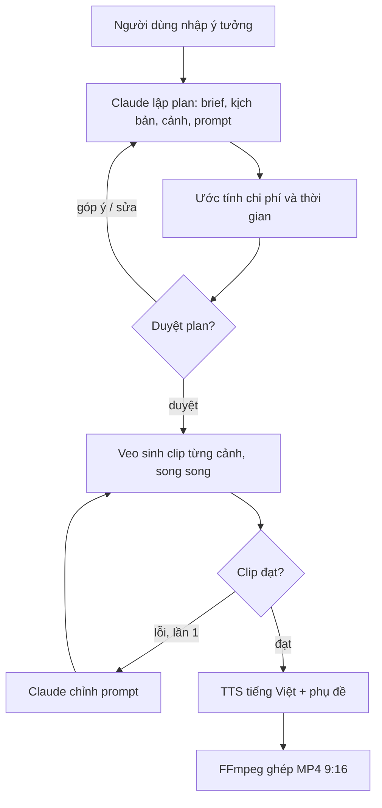
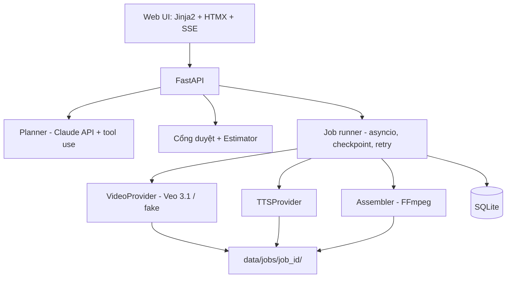

# Kiến trúc

## Luồng agent



Vòng "sửa plan" không giới hạn (chưa tốn tiền video). Vòng "sinh lại clip" tối đa 1 lần/cảnh.

## Thành phần



## Trạng thái job

```
draft -> planning -> awaiting_approval -> generating -> assembling -> done
                 \-> (revise) -> planning
bất kỳ -> failed | cancelled
```

Trạng thái cảnh: `planned -> generating -> generated -> qc_failed -> regenerating -> approved | failed`

## Thư mục job

```
data/jobs/<job_id>/
  plan.json            # bản plan mới nhất (plan.v1.json, plan.v2.json... khi viết lại)
  clips/scene_01.mp4
  audio/scene_01.wav
  subtitles.ass
  music.mp3            # nếu có
  final.mp4
  log.jsonl
```

## API

| Method | Path | Mô tả |
| --- | --- | --- |
| POST | `/api/jobs` | Tạo job từ ý tưởng + tùy chọn → chạy planner |
| GET | `/api/jobs` | Danh sách job gần đây |
| GET | `/api/jobs/{id}` | Chi tiết job + plan + trạng thái cảnh |
| POST | `/api/jobs/{id}/revise` | `{feedback}` → Claude viết lại cả plan |
| PATCH | `/api/jobs/{id}/scenes/{n}` | Sửa tay một cảnh |
| POST | `/api/jobs/{id}/scenes/{n}/rewrite` | Claude viết lại một cảnh |
| POST | `/api/jobs/{id}/approve` | Duyệt → bắt đầu sinh video (kiểm tra trần chi phí) |
| POST | `/api/jobs/{id}/cancel` | Hủy |
| GET | `/api/jobs/{id}/events` | SSE: tiến trình, log, chi phí |
| GET | `/api/jobs/{id}/video` | Tải final.mp4 |
| GET | `/api/jobs/{id}/plan.json` | Tải plan |

Trang HTML: `/` (nhập ý tưởng), `/jobs/{id}` (hiển thị màn hình 2, 3 hoặc 4 theo trạng thái).

## Veo qua Gemini API (tham khảo)

Gọi là thao tác bất đồng bộ: `client.models.generate_videos(model=..., prompt=..., config=...)` trả về
operation, poll bằng `client.operations.get(operation)` đến khi `done`, rồi tải file.
Tài liệu: https://ai.google.dev/gemini-api/docs/video
